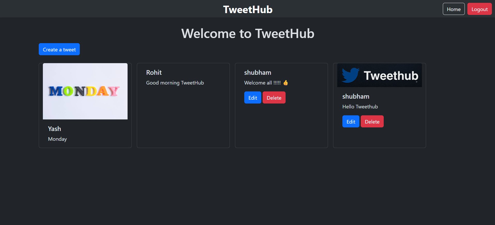

# 🐦 TweetHub

<p align="center">
  
</p>

## 📖 About

TweetHub is a Twitter-inspired social media web application built with **Django**.

The project started as a CRUD application and is gradually evolving into a complete social networking platform. It focuses on learning Django by implementing real-world features such as authentication, user profiles, media uploads, and tweet management.

> **Note:** This is a learning and portfolio project that is continuously being improved with new features.

---

## 📸 Project Preview

<p align="center">
  
</p>

---

## ✨ Features

### Authentication
- 👤 User Registration
- 🔐 User Login
- 🚪 User Logout

### Tweets
- 📝 Create Tweets
- ✏️ Edit Your Own Tweets
- 🗑️ Delete Your Own Tweets
- 🖼️ Upload Images with Tweets

### User Profiles
- 👤 User Profile Page
- 📷 Profile Picture Upload
- 🖼️ Cover Image Upload
- 📝 Edit Bio
- 📍 Location
- 🌐 Website
- 📅 Joined Date
- 📄 View Your Tweets on Profile

### UI
- 🏠 Landing Page
- 📱 Responsive Bootstrap Design
- 🔒 Users can edit/delete only their own tweets

---

## 🛠️ Tech Stack

- Python
- Django
- SQLite3
- Bootstrap 5
- HTML5
- CSS3
- Git
- GitHub

---

## 📂 Project Structure

```text
TweetHub/
│
├── TweetHub/
├── tweet/
├── templates/
├── static/
├── media/
├── screenshots/
├── manage.py
├── db.sqlite3
├── requirements.txt
└── README.md
```

---

## ⚙️ Requirements

- Python 3.10+
- Git
- pip

---

## 🚀 Installation

### 1. Clone the repository

```bash
git clone https://github.com/shubham2894/TweetHub.git
```

### 2. Navigate into the project

```bash
cd TweetHub
```

### 3. Create a virtual environment

**Windows**

```bash
python -m venv env
```

Activate:

```bash
env\Scripts\activate
```

**macOS / Linux**

```bash
python3 -m venv env
source env/bin/activate
```

### 4. Install dependencies

```bash
pip install -r requirements.txt
```

### 5. Apply migrations

```bash
python manage.py migrate
```

### 6. Create an admin account (Optional)

```bash
python manage.py createsuperuser
```

### 7. Start the server

```bash
python manage.py runserver
```

Open:

```
http://127.0.0.1:8000/
```

Admin Panel:

```
http://127.0.0.1:8000/admin/
```

---

## 📚 Learning Outcomes

Through this project I learned:

- Django Project Structure
- Django Apps
- URL Routing
- Function-Based Views
- Django Models
- Model Relationships
- Model Forms
- Authentication
- CRUD Operations
- User Profiles
- Image Uploads
- Static & Media Files
- Bootstrap Integration
- Git & GitHub

---

## 🚀 Roadmap

### ✅ Completed

- Landing Page
- User Authentication
- Tweet CRUD
- Image Upload
- User Profile
- Edit Profile
- Profile Picture
- Cover Image
- Bio
- Location
- Website
- Profile Timeline

### 🔄 In Progress

- Follow / Unfollow Users

### 📌 Planned Features

- ❤️ Like Tweets
- 💬 Comments
- 👥 Followers & Following
- 🔍 Search Users
- 🔍 Search Tweets
- ⭐ Bookmarks
- 🔔 Notifications
- 🌙 Dark Mode
- 📊 User Dashboard
- 📱 Responsive Improvements
- ⚡ Real-time Feed
- 💬 Direct Messaging
- 🤖 AI Features
- 🌐 Django REST Framework API

---

## 📄 License

This project is created for educational and portfolio purposes.

---

## 👨‍💻 Author

**Shubham Chavan**

GitHub: https://github.com/shubham2894

---
